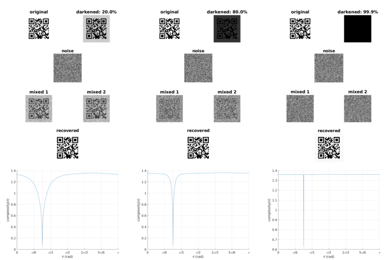
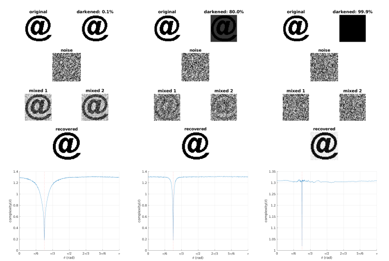
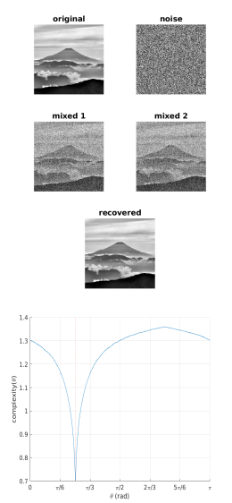

# Blind source extraction (BSE) of images based on complexity measure

Examples of blind source extraction (BSE) of images based on Kolmogorov-Chaitin complexity, which is estimated by means of lossless compression of data (in this case, the LZW compression of TIFF images).

To perform the BSE, we assume that the mixtures are more complex (_i.e._, can be less compressed) than the source image. The contrast or score function, which is named _kcc_, corresponds to the ratio of the file size of the compressed image to the file size of the same uncompressed image:

          file size of the compressed image
    kcc = -----------------------------------
          file size of the uncompressed image

## Mixing and extraction

_A_ is a full rank mixing matrix:

    A = [cos(phi)  -sin(phi)
         sin(phi)   cos(phi)],

where _phi_ is the mixing angle. _w_ is the extraction vector:

    w = [cos(theta)  sin(theta)]^T,

in which _T_ indicates the transpose operation and theta is in the interval [0, pi].

Before applying the mixing process, the images are converted to 1-D arrays. Then, we have:

    x = A*s,

where _x_ corresponds to the mixed images and _s_ are the sources (one is the image of interest and the other is a noisy image). The extraction process is obtained by:

    y = w*x.

_y_ is the recovered image.

## Darkening

In these examples, we are dealing with grayscale and black & white images. For grayscale images, pixel value ranges from 0 to 1, 0 being totally black and 1 totally white. The "darkening process" decreases the value of each pixel in the image. This is an interesting process: as the image gets darker, it becomes harder to recognize the original image in the mix with noise.

## Examples

### Example #1: QR Code

**Figure 1: QR Code** _The images show the darkening, mixing, and extraction processes. Right below, the evolution of the complexity measure for values of_ theta _ranging from_ 0 _to_ pi _._

### Example #2: @ Sign

**Figure 2: @ Sign** _The images show the darkening, mixing, and extraction processes. Right below, the evolution of the complexity measure for values of_ theta _ranging from_ 0 _to_ pi _._

### Example #3: Photography of the Mt. Fuji

**Figure 3: Mt. Fuji** _The images show the mixing and extraction processes. Right below, the evolution of the complexity measure for values of_ theta _ranging from_ 0 _to_ pi _._

## References

P. Pajunen, "Blind source separation using algorithmic information theory", Neurocomputing, v. 22, 1-3, pp. 35-48, 1998. DOI: [doi.org/10.1016/S0925-2312(98)00048-4](https://doi.org/10.1016/S0925-2312(98)00048-4).

D. C. Soriano, R. Suyama, and R. Attux, "Blind extraction of chaotic sources from mixtures with stochastic signals based on recurrence quantification analysis", Digital Signal Processing, v. 21, 3, pp. 417-426, 2011. DOI: [doi.org/10.1016/j.dsp.2010.12.003](https://doi.org/10.1016/j.dsp.2010.12.003).

## Credits

All the credits for the beautiful photography of the Mt. Fuji goes to [かねのり 三浦](https://pixabay.com/pt/users/Kanenori-4749850/?utm_source=link-attribution&amp;utm_medium=referral&amp;utm_campaign=image&amp;utm_content=2232246).

## License

See [LICENSE](LICENSE) for more information.
